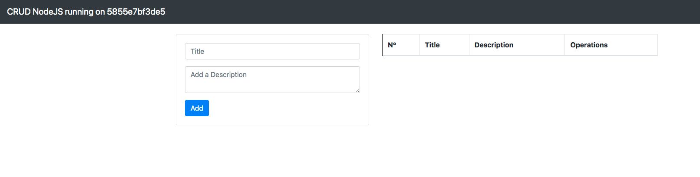
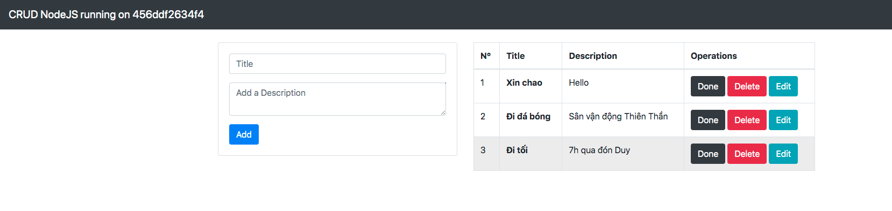

Triển khai docker-swarm cho ứng dụng nodejs

- Node 1: 192.168.0.12
- Node 2: 192.168.0.13

### Join swarm

- 192.168.0.12 (manage)

```
docker swarm init --advertise-addr 192.168.0.12

#token
docker swarm join --token SWMTKN-1-2q7q9fkzgqi3sq385lo4kj04cvj600l4u4aysx8z3374omx2zk-4ixlbu50qf2s13pyncnsgakc7 192.168.0.12:2377
```

- 192.168.0.13 (work)

```
# join token
docker swarm join --token SWMTKN-1-2q7q9fkzgqi3sq385lo4kj04cvj600l4u4aysx8z3374omx2zk-4ixlbu50qf2s13pyncnsgakc7 192.168.0.12:2377
```

### Create overlay network

Tạo 1 internal overlay network:

```
docker network create –d overlay myapp
```

### Triển khai

Tạo file **docker-compose.yml**

```
version: "3.3"

networks:
  myapp:
    external: true

services:
  mongodb:
    image: mongo:latest
    volumes:
      - "/dbdata:/data/db"
    network:
      - myapp
    deploy:
      placement:
        constraints:
          - node.role == worker
          - node.hostname == 192.168.0.13

  nodejs:
    image: buihien0109/demo-service:latest
    depends_on: 
      - mongodb
    network:
      - myapp
    ports:
      - "8000:3000"
    environment: 
      MONGODB_URI: mongodb://mongodb:27017/demo
      PORT: 3000
    deploy:
      replicas: 2

```

Tạo thư mục **/dbdata** để mount volume trên node 192.168.0.13

Triển khai service bằng docker-compose

```
docker stack deploy -c docker-compose.yml app
```

### Kết quả

Kết quả ban đầu




Khi thêm todo

